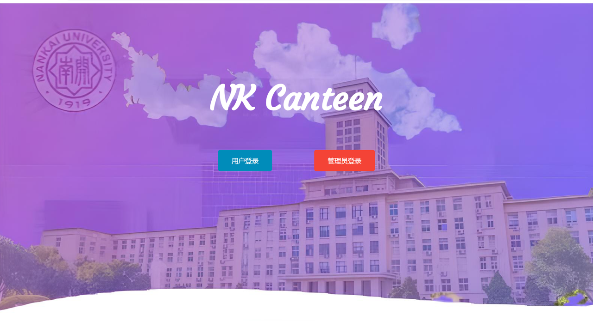
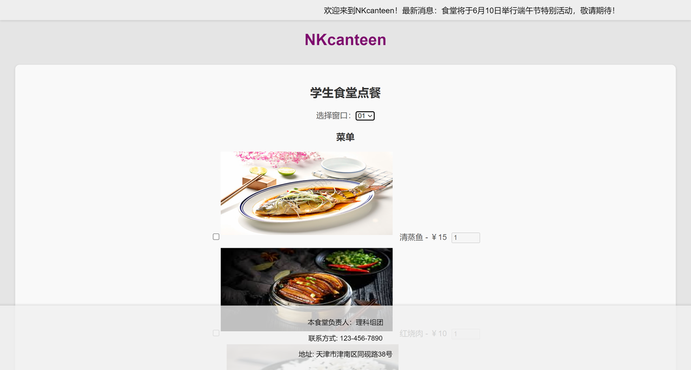

南开大学软件学院前端实习实训项目**NKcanteen**代码仓库

## 项目简介

项目成员：邝伟华、冯金涛、谢其桐、王鼎

本项目是基于Vue框架的前后端综合餐厅管理服务系统

系统分为用户端和窗口端，

提供从用户登录、座位管理、点餐到窗口菜品管理的全流程功能。

<table>
  <tr>
    <td>
      <div style="text-align:center">
        
        <p>功能架构设计</p>
      </div>
    </td>
  </tr>
</table>

## 使用说明

```
1. clone 本仓库到本地
2. npm install 安装依赖
3. cd ./server 文件夹 create_table.sql 在本地MySQL数据库建表
4. ./server/server.cjs 中更改本地数据库 config 配置信息
5. node server.cjs 启动数据库连接
6. cd .. 根目录下 npm run dev 启动网页
```
## 技术栈

前端使用Vue框架搭建框架，集成利用Node.js的功能包，

后端连接MySQL数据库处理交互数据，

使用Git连接GitHub仓库实现代码开发管理。

## 开发日志

- 讨论项目选题 20240515
- 分工确定任务 20240520
- 基本完成分块组件设计 v1.0 20240604
- 组合全部组件 v2.0 20240611
- 总结项目 20240622

## 主体页面展示

<table>
  <tr>
    <td>
      <div style="text-align:center">
        
        <p>登录界面</p>
      </div>
    </td>
    <td>
      <div style="text-align:center">
        
        <p>座位预约</p>
      </div>
    </td>
  </tr>
  <tr>
    <td>
      <div style="text-align:center">
        
        <p>点餐窗口</p>
      </div>
    </td>
    <td>
      <div style="text-align:center">
        
        <p>窗口管理</p>
      </div>
    </td>
  </tr>
</table>

**欢迎沟通交流！copyright@NKcanteen**
