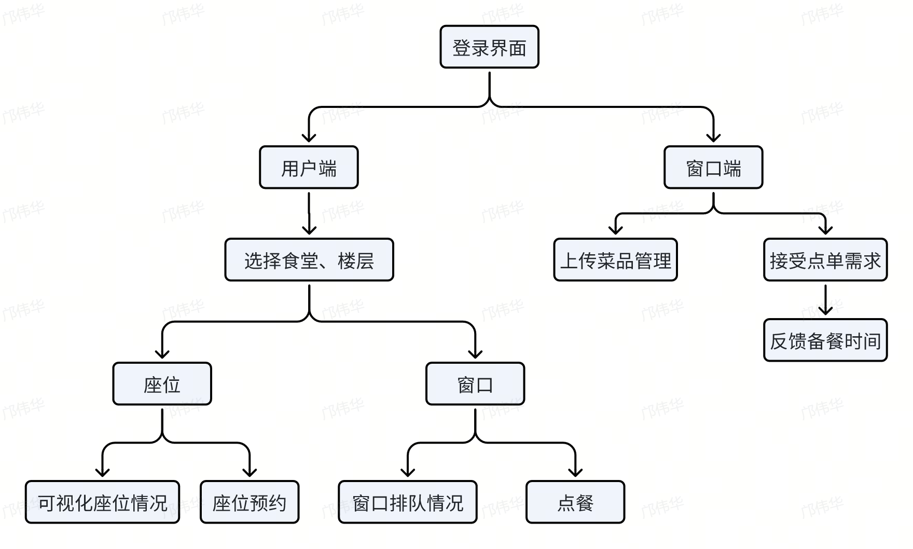

# 项目日志

```
download 至本地之后
运行 npm install 安装相关配置文件：node_mudules
```

## 1. 命名规范

```
1.1 文件命名

- 变量、属性、参数：下划线命名 user_name
- 函数：小驼峰命名 username
- 类名、类型：大驼峰命名 UserName
- 文件、文件夹：中划线命名 user-name

1.2 Git提交 git commit -m "message"

代码类

- feat：添加新功能
- fix：修复bug

- refactor：**重构**代码
- perf：性能提高

非代码类

- docs：**文档**修改

- style：**样式**修改
- build：工具包或者外部依赖的改动，如gulp,npm等进行的改动
- chore：其他不针对src或者test部分，以外的修改，例如构建过程或辅助工具的变动

其它

- test：添加缺失的测试或者修改现有测试
- ci：CI（持续集成服务）的配置文件和脚本的更改
- revert：执行git revert打印的message，恢复上一次提交。
```

## 2. 项目分工

20240522

 我们的食堂项目面向两个用户端侧：就餐用户端与窗口供应端。

- 就餐用户端：

  - 选择目前食堂、楼层
  - 选择窗口、选购菜品（或许可以加菜品备注？）进行排号，查看预计取餐时间
  - 进行座位预约

- 窗口供应端

  - 管理、更新窗口菜品情况
  - 接受菜品点购，提供备餐时长
  - 接收用户反馈信息

  

## 3. 项目进程

1. 沟通确定项目开发需求 20240510

2. 基本分工完成各自部分 20240604

3. 上传 V1.0 至 main 分支 20240611

